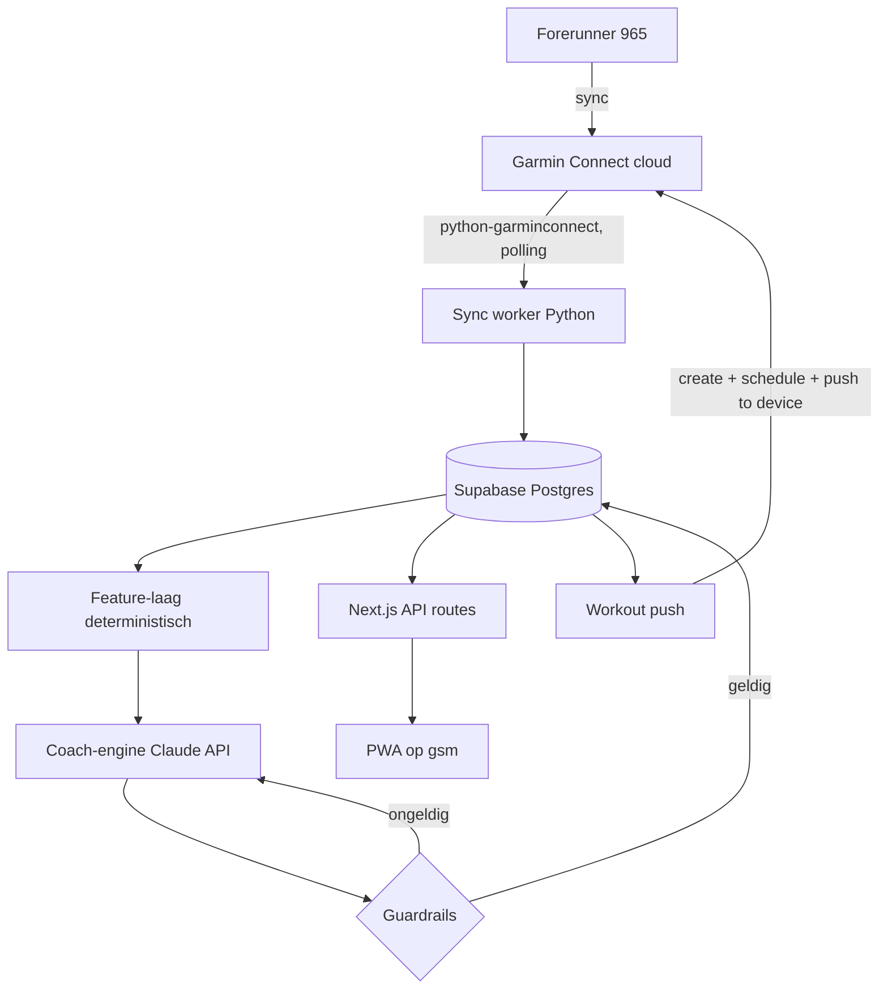

# Training Manager — Concept & Architectuur

> AI personal trainer op basis van pure Garmin-metrics. Geen giswerk.
>
> Status: 12 augustus 2026.
> Supabase-project `jyyrbjaavvlfhgtpintg` (`training_manager`, eu-west-1) — 20
> tabellen, RLS actief, Storage-bucket `garmin-fit`.
> **Gebouwd:** sync-worker (`tm_sync`), feature-laag, coach-engine (`tm_coach`).
> **Data:** 83 activiteiten, 414 wellness-dagen, 78 routes, 83 FIT-archieven,
> 82 dagen en 75 weken aan features, 8 actieve regels.
> **Nog te doen:** eerste AI-planvorming draaien (wacht op `ANTHROPIC_API_KEY`),
> workout-push naar het horloge, de PWA.

## 1. Wat het is

Een PWA die Garmin Connect-data combineert met een AI-coach (Claude API). De app
toont je metrics én je trainingsschema, en dat schema past zichzelf continu aan op
basis van wat er écht gebeurt: uitgevoerde runs, slaap, HRV, Training Readiness,
je eigen feedback na elke run, geskipte dagen en wijzigingen in je doel.

De AI-gegenereerde sessies worden als gestructureerde workouts naar de Garmin
Forerunner 965 gepusht, inclusief HR-limieten per interval.

### Ontwerpprincipes

1. **De AI is de coach, niet de rekenmachine.** Zones, belasting, ACWR en trends
   worden deterministisch berekend. De AI krijgt afgeleide features, nooit ruwe dumps.
2. **Veiligheid overruled doelgerichtheid.** Een harde guardrail-laag valideert elk
   AI-voorstel. Pijnscore grijpt daadwerkelijk in.
3. **Huidige vorm ≠ historische vorm.** Zones en tempo's komen uit recente data,
   nooit uit de marathonvorm van 2025.
4. **Elke ingreep verantwoordt zichzelf, met cijfers.** Niet alleen "je schema is
   aangepast", maar welke regel het deed en op basis van welke waarden — getoond bij
   de sessie waar het over gaat, niet weggestopt in een logboek. Een app die je
   begrenst zonder uitleg voelt als willekeur, en die ga je terecht negeren.
5. **De app leest uit de eigen database, niet uit Garmin.** Snel, offline-bruikbaar.

## 2. Scope

### In v1
- Garmin-sync (activiteiten, wellness, trainingsstatus) naar eigen database
- Dashboard: slaap, HRV, VO2max, Body Battery, Training Readiness, HR-zoneverdeling
- Instelbare doelen (doeltype configureerbaar in de PWA)
- AI-gegenereerd, zelfaanpassend trainingsschema
- Gestructureerde workouts pushen naar de FR965
- Adaptieve feedback na elke run
- Wekelijkse review
- Routes van je runs op een kaart in de PWA
- FIT-archief in Supabase Storage (eigen kopie van elke activiteit)
- Nederlands + Engels

### Bewust later
- Triatlon (fietsen/zwemmen) — datamodel is er klaar voor, coachlogica niet
- Krachttraining als ingepland onderdeel
- Meerdere gebruikers (v1 is single-user)

## 3. Architectuur



**Waarom twee talen:** `python-garminconnect` is Python-only en is de enige serieuze
weg naar Garmin Connect. De rest van de app is Next.js/TypeScript, wat je al kent.
De Python-service is bewust dun: sync + workout-push, verder niets.

**De worker trekt, de app duwt nooit.** De PWA praat niet met Garmin — ze kan het niet
eens: de tokens zitten bij de worker. Drukt hij in de app op "sync", dan zet de app
alleen een aanvraag in `sync_log` met status `requested`; de worker ziet die binnen
vijftien seconden, claimt hem (`running`) en sluit dezelfde rij af met `ok` of `error`.
Eén tabel blijft zo de waarheid over wanneer er voor het laatst met Garmin is gepraat,
en dezelfde knop werkt straks op de VPS zonder één regel anders — daar staan web en
worker in aparte containers en is een directe aanroep sowieso geen optie. Een unieke
index laat maar één wachtende aanvraag toe: twee keer drukken haalt dezelfde data op.

### Deployment
- **VPS** (Hetzner, EU-IP) met beide services in Docker Compose
- **Supabase** voor Postgres + auth
- Garmin-tokens: één keer **lokaal** inloggen met `garmin-mcp-auth`, daarna
  `~/.garminconnect/garmin_tokens.json` naar de VPS kopiëren. De VPS refresht zelf
  en raakt de loginflow nooit aan (omzeilt Cloudflare-checks op datacenter-IP's).
  Tokens verlopen na ~6 maanden → notificatie bij naderend verval.

## 4. Datamodel

### Laag 1 — Ruwe data (append-only, idempotente upserts)

| Tabel | Inhoud |
|---|---|
| `activities` | Activiteit-header: id, sport, start, duur, afstand, gem/max HR, tempo, TE |
| `activity_laps` | Splits per activiteit |
| `activity_zones` | Tijd per HR-zone per activiteit |
| `wellness_daily` | Slaap, HRV-status, Body Battery, rust-HR, stress, Training Readiness |
| `fitness_snapshots` | VO2max, race predictor, training status, endurance/hill score |
| `activity_tracks` | Encoded polyline + bounds per activiteit, voor kaartweergave |
| `sync_log` | Wat wanneer opgehaald is, voor idempotentie en debugging |

`activities.sport` is er vanaf dag één — daarom kost triatlon later geen migratie.

**FIT-archief.** Bij elke sync wordt het volledige FIT-bestand van een activiteit
weggeschreven naar de Storage-bucket `garmin-fit` (~100–200 KB per run, hele
historie ≈ 10 MB). `activities.fit_path` verwijst ernaar. Daarin zit per seconde
hartslag, GPS, cadans en power. Dit is geen luxe maar de verzekering tegen het
grootste risico van dit project: we hangen aan een unofficiële API. Met dit archief
kan elke toekomstige analyse of visualisatie opnieuw afgeleid worden zonder Garmin.

**Routes.** `activity_tracks` bevat een encoded polyline (~20 KB per run in plaats
van ~200 KB ruwe punten) plus bounds voor auto-zoom. Weergave-only: geen enkele
coachbeslissing hangt eraan, en de tabel kan altijd opnieuw opgebouwd worden uit
het FIT-archief.

### Laag 2 — Afgeleide features (herberekend na elke sync)

Per dag en per week:
- weekvolume (km + duur), **tijdsverdeling over HR-zones**
- ACWR (7d acute : 28d chronische belasting), monotonie, strain
- slaap 7d-gemiddelde + slaapschuld, HRV-baseline en afwijking, readiness-trend
- **huidige fitheid**: kritische snelheid / race-equivalent uit de laatste 6 weken,
  expliciet gescheiden van `historical_fitness` (2025-marathonvorm)
- adherence per geplande sessie: gepland vs. uitgevoerd op afstand, tempo, zonetijd

Deze laag bevat geen AI. Als hier een fout in zit, is elk schema fout.

**Vormschatting is per afstand begrensd.** Riegel-omrekening is alleen bruikbaar
binnen ongeveer een factor 3 rond de gelopen afstand. Ongelimiteerd extrapoleren gaf
op Jaspers historie een marathonvoorspelling van 3:05:49 tegenover een werkelijke
3:43:40 — een snelle korte training voorspelt dan een marathon die nooit gelopen
wordt. Met de begrenzing komt de schatting op 3:39:45, binnen vier minuten. Is er
geen inspanning binnen het geldige bereik, dan is de schatting expliciet `null`;
`fitness_estimates.basis` legt per afstand vast welke run eronder ligt.

**ACWR heeft een bodem.** Onder een chronische belasting van 50 is de verhouding
betekenisloos: na een rustperiode levert één run al een ratio van 4+ op. Daar mag
geen guardrail op ingrijpen, dus dan is `acwr` bewust `null`.

### Laag 3 — Doelen (instelbaar in de PWA)

Een doel is een record, geen hardcoded pad. Doeltypes:

| `goal_type` | Velden | Gedrag |
|---|---|---|
| `return_to_run` | startniveau, streefvolume | Walk/run-progressie, conservatieve ramp-rate, geen intensiteit tot basis staat |
| `race` | afstand, datum, streeftijd (optioneel) | Terugrekenen vanaf racedatum, blokopbouw + taper, haalbaarheidscheck |
| `time_target` | afstand, streeftijd | App bepaalt zelf de duur, haalbaarheidscheck is leidend |
| `maintenance` | weekvolume | Onderhoud zonder progressie |

Doel wisselen of aanpassen is een trigger voor volledige herplanning. Meerdere doelen
kunnen bestaan (historie), één is actief.

**Eerste doel dat we aanmaken:** `return_to_run` — passend bij de huidige situatie
(laatste run juli 2026, VO2max 49, terugkeer na blessure). Maar het is een record dat
je in de app aanmaakt en wijzigt, niet een ingebakken aanname.

### Laag 4 — Plan (geversioneerd)

```
plans            id, goal_id, version, created_at, trigger, reason,
                 status (proposed|active|superseded)
plan_sessions    plan_id, date, sport, session_type, structure (jsonb),
                 targets (jsonb), status (planned|completed|skipped|moved)
session_feedback session_id, pain_score, endurance_score, extra (jsonb), notes
```

**Autonomie volgt nieuwe zwaarte.** Een herplanning met alleen `info`- en
`limit`-ingrepen wordt direct `active`. Een plan met een **nieuwe** `override`
blijft `proposed` tot Jasper akkoord geeft; het geldende plan blijft ondertussen
gewoon gelden. Bewust "nieuwe": `return_to_run_phase` vuurt in elke herplanning
zolang de terugkeerfase duurt, en daar elke keer opnieuw akkoord voor vragen maakt
van de goedkeuring een lege formaliteit. Vragen bij verandering, niet bij herhaling.

`structure` is Garmin-workout-compatibel, zodat pushen naar het horloge een directe
vertaling is en geen herinterpretatie:

```json
{
  "steps": [
    { "type": "warmup",   "duration_min": 10, "hr_max": 145 },
    { "type": "interval", "repeat": 6,
      "work": { "duration_min": 3, "hr_min": 165, "hr_max": 175 },
      "rest": { "duration_min": 2, "hr_max": 140 } },
    { "type": "cooldown", "duration_min": 10, "hr_max": 140 }
  ]
}
```

Elke planversie bewaart `trigger` en `reason` → voedt het **"waarom is mijn schema
veranderd"**-scherm in de app.

## 5. Coach-engine

### Triggers (de AI draait nooit bij het openen van een scherm)

| Trigger | Model | Reikwijdte |
|---|---|---|
| Run gesynct + feedback ingediend | Sonnet 5 | Komende 3–7 dagen |
| Sessie geskipt (dag rolt om) | Haiku 4.5 | Herverdeling lopende week |
| Doel aangemaakt/gewijzigd | Opus 5 | Volledige herplanning |
| Wekelijkse review (zondagavond) | Opus 5 | Review + volgend blok |
| Alarmsignaal (zie guardrails) | Opus 5 | Deload / rust |

### Context naar het model (~10–15k tokens)

Statisch blok (**prompt-cached**, `cache_control: ephemeral`): atleetprofiel, doel,
zones, coachingregels. Volatiel blok erna: features laatste 14 dagen, weekaggregaten
laatste 8 weken, huidig plan, laatste feedback.

### Output: structured outputs, geen vrije tekst

`output_config.format` met een json_schema die een **plan-diff** teruggeeft:
te wijzigen sessies, reden per wijziging, en een korte toelichting voor de gebruiker.
De app hoeft nooit tekst te parsen.

### Guardrails (deterministisch, wint altijd)

| Regel | Actie bij overtreding |
|---|---|
| Pijnscore ≥ drempel | Volume omlaag / intensiteit eruit / rust opleggen. **Overruled het doel.** |
| Slaap 7d-gemiddelde < 6,0 u | Weekvolume groeit niet, ook als de ramp-rate het toestaat. Consolideren i.p.v. opbouwen |
| Weekvolume-toename > 10% | Clampen naar 10% |
| ACWR buiten 0.8–1.3 | Volume corrigeren |
| Kwaliteitssessie bij lage Training Readiness | Omzetten naar easy |
| < 48u tussen kwaliteitssessies | Verplaatsen |
| Lange duurloop > ~30% weekvolume | Inkorten |
| Easy run zonder HR-bovengrens | Bovengrens toevoegen (verplicht veld) |
| Nieuw doel zonder terugkeer-fase (na inactiviteit) | Fase invoegen |
| Prestatiedoel zonder kwaliteitssessie of lange duurloop per week | Plan afgekeurd — **vangt ondertraining af** |
| Kwaliteitssessie zonder tempo- of hartslagdoel | Plan afgekeurd — een interval zonder doel is stuurloos |
| Tempodoel sneller dan de huidige vorm toelaat | Plan afgekeurd, met de vormschatting als bewijs |

Bij afkeuring gaan de validatiefouten terug naar het model voor een herkansing. Blijft
het fout, dan clampt de app deterministisch en logt dat.

**Guardrails werken twee kanten op.** De meeste voorkomen dat er te veel gevraagd
wordt. `quality_variety_required` doet het omgekeerde: bij een race- of tijdsdoel
moet elke week minstens één kwaliteitssessie (tempo of interval) en één lange duurloop
bevatten. Een schema van alleen easy runs is dan niet veilig maar ineffectief — het
bouwt duur op en geen snelheid, en het doel wordt niet gehaald. De regel zwijgt tijdens
een terugkeerfase en zolang er nog geen basis ligt (minder dan 6 runs in 21 dagen),
zodat hij nooit intensiteit toevoegt aan iemand die net begint.

**Hartslag of tempo hangt af van het sessietype.** Bij `easy`, `long` en `recovery` is
het HR-plafond leidend en verplicht: bij hitte, wind of vermoeide benen loop je hetzelfde
tempo op een veel hogere hartslag, en precies daar ontspoorde de training eerder. Tempo
remt daar niets. Bij `tempo`, `interval` en `race` is het omgekeerd — hartslag loopt
achter op de inspanning, dus bij een herhaling van drie minuten zit de HR pas op niveau
als de herhaling half voorbij is. Daar is tempo leidend en hartslag informatief. Het
sessieveld `target_type` (`hr` / `pace` / `both` / `none`) legt die keuze vast; de
tempodoelen staan per stap in `pace_min_s_per_km` en `pace_max_s_per_km`. Is de
vormschatting onzeker (kleine steekproef), dan wordt de band breder — nooit leeg.

De coach krijgt daarnaast in de systeemprompt mee welke sessietypes bestaan, wat elk
doet, en welke mix bij welk doel hoort: intervallen als motor voor 5 en 10 km, lange
duurloop en tempowerk voor halve en hele marathon, geen intensiteit tijdens een
terugkeerfase. Plus drie opbouwregels: gepolariseerd verdelen (~80% rustig), nooit
volume én intensiteit in dezelfde week verhogen, en werken in blokken van drie weken
opbouw met een lichtere week erna.

**Elke ingreep wordt vastgelegd in `plan_adjustments`**, gekoppeld aan de sessie waar
hij op slaat: welke regel, hoe zwaar (`info` / `limit` / `override`), een uitleg in NL
en EN, en `evidence` met de getallen die hem veroorzaakten. De app toont dus niet
"aangepast op basis van je herstel", maar *"deze week groeit je volume niet: je sliep
de afgelopen 7 dagen gemiddeld 5,4 uur, drempel is 6,0"*. Zonder die cijfers is een
beperking niet te controleren en dus niet te vertrouwen.

**Waarom de slaapregel bestaat.** Uit de eigen historie (gemeten 12 aug 2026): in de
laatste 30 dagen slaapt Jasper gemiddeld 5,9 u met 16 van 26 nachten onder de 6 uur.
In het marathonblok van aug–sep 2025 was dat 6,0 u — vrijwel identiek — en daar liep
het uit op HRV vijf dagen uit balans en readiness rond 46. De huidige goede HRV (68)
en readiness (65) komen door een trainingsbelasting van nul, niet door beter herstel.
Volume opbouwen op deze slaapbasis reproduceert waarschijnlijk hetzelfde patroon.

**Alarmsignalen** die zelfstandig een deload triggeren: HRV 3 dagen uit balans,
readiness meerdere dagen onder drempel, oplopende slaapschuld, of twee opeenvolgende
runs met verhoogde pijnscore.

### Lerende regels

De coach mag regels toevoegen, aanscherpen en intrekken — zodat het schema zich
richt op Jaspers werkelijke gedrag in plaats van op generieke aannames. Maar niet
onbeperkt: de guardrails bestaan juist om de AI te begrenzen, en een AI die zijn eigen
rem mag weghalen heeft geen rem. Daarom drie klassen in `coach_rules`:

| Klasse | Wie beheert | Voorbeeld |
|---|---|---|
| `core` | Vast. De coach kan niet wijzigen, niet intrekken, niet verwijderen. | Pijnscore overruled het doel; max +10% weekvolume; ACWR-band; verplichte HR-bovengrens op easy runs |
| `tunable` | Coach mag de drempel verschuiven binnen `param_bounds`, met bewijs | Slaapdrempel 6,0 u (band 5,0–7,0); readiness-poort 50 (band 35–70) |
| `learned` | Coach mag zelf toevoegen en intrekken | Patronen die alleen uit Jaspers data volgen |

**Afgedwongen in de database, niet in de prompt.** Een prompt is een verzoek; een
trigger is een grens. `enforce_rule_governance()` blokkeert het intrekken of wijzigen
van kernregels en weigert parameters buiten hun band. Geverifieerd: een poging
`pain_score_override` in te trekken faalt, en de slaapdrempel op 4,0 u zetten faalt,
terwijl 5,5 u binnen de band wél wordt geaccepteerd.

**Twee waarborgen tegen overfitting.** Een taalmodel ziet met plezier een patroon in
vier waarnemingen, en 73 runs is voor veel hypotheses te weinig. Daarom blijft een
geleerde regel `proposed` tot `sample_size >= min_sample`, en wordt hij daarna
periodiek getoetst in `coach_rule_evaluations`: voorspelt hij niet wat hij belooft,
dan gaat hij eruit. Elke wijziging aan elke regel komt met reden en bewijs in
`coach_rule_events`.

**Jasper heeft het laatste woord.** `user_pinned` zet een regel vast; de coach mag
hem dan niet meer aanraken. `status = 'vetoed'` schakelt een niet-kernregel uit.

## 6. Feedback-loop (adaptief)

Standaard na elke run: **twee sliders** (pijn/blessure, uithouding) + optionele notitie.
Klaar in vijf seconden — consistente invoer is meer waard dan rijke invoer.

Doorvragen gebeurt alleen als er iets opvalt:
- pijnscore boven drempel → *waar zat het, en wanneer begon het?*
- grote afwijking van het plan → *wat gebeurde er?*
- lage readiness maar goede run (of omgekeerd) → korte controlevraag

De coach-engine bepaalt zelf welke vervolgvraag hij stelt; die vraag wordt als veld
in de app getoond, niet als chatbericht.

## 7. Sync & latency

Adaptieve polling — geen webhooks beschikbaar op de unofficiële API:

| Venster | Frequentie | Waarom |
|---|---|---|
| 06:00–10:00 | elke 5 min | Slaap/HRV/readiness landen bij de ochtendsync |
| Eerste uur na gedetecteerde activiteit | elke 5 min | Run zo snel mogelijk binnen |
| Overige tijd | elke 30 min | Garmin niet hameren |

Realistische latency: run zichtbaar ~2–10 min na afloop (afhankelijk van je gsm-sync).
Nachtdata 's ochtends. De PWA zelf is instant, want die leest uit de eigen database.

## 8. Workout-push naar de FR965

Bij het aanmaken/wijzigen van een plan worden de komende 7 dagen naar Garmin gezet:

1. `create workout` uit `plan_sessions.structure`
2. `schedule_workout(workout_id, date)`
3. `push_workout_to_device(workout_id, device_id)`

Bij een planwijziging: `unschedule_workout` voor vervallen sessies, daarna opnieuw.
Workout-ids worden in de database bijgehouden zodat in-place edits mogelijk zijn
zonder de planning te breken.

Dit is meteen de directe fix voor het grijze-zone-patroon: elke easy run krijgt een
HR-bovengrens mee, en het horloge waarschuwt bij overschrijding.

## 9. Modellen & kosten

| Taak | Model | Kosten |
|---|---|---|
| Volledige herplanning / wekelijkse review | `claude-opus-5` ($5/$25 per M) | **$0,95 gemeten** (met 1 herkansing), ~$0,50 zonder |
| Aanpassing na run | `claude-sonnet-5` ($3/$15 per M) | geschat ~$0,10 |
| Geskipte dag herverdelen | `claude-haiku-4-5` ($1/$5 per M) | geschat ~$0,02 |

**Meting van de eerste echte planvorming (12 aug 2026):** 21.226 input-tokens
(4.335 uit cache), **32.624 output-tokens**, 365 seconden, $0,9456 met één
herkansing. De eerdere schatting van $0,25 was fout omdat denk-tokens als output
geteld en betaald worden — Opus 5 denkt standaard op `effort: high`.

Twee kostenposten en hun remedie:
1. **Herkansingen verdubbelen de prijs.** De eerste poging overtrad de ramp-rate
   omdat het model zelf moest afleiden welke week de referentie was. Sindsdien
   krijgt het die grenzen voorgerekend mee in `context.constraints`.
2. **Denk-tokens domineren de output.** Verlagen van `effort` naar `medium` is de
   knop daarvoor, tegen een kwaliteitsafweging die per triggertype getest moet worden.

Realistisch bij wekelijkse herplanning plus dagelijkse aanpassingen: **$3–5 per maand**.

## 10. Roadmap — dunne end-to-end slice eerst

### Slice 1 — De keten werkend (lelijk mag)
1. Python sync-worker: **volledige historie** (vanaf maart 2025, ~73 runs) + wellness
   naar Postgres, inclusief FIT-archief naar Storage en polylines in `activity_tracks`.
   De hele historie is nodig om historische vorm van huidige vorm te kunnen scheiden;
   daarna incrementeel syncen
2. Feature-laag: weekvolume, zoneverdeling, ACWR, readiness-trend
3. Doel aanmaken in de app (`return_to_run`)
4. Coach-engine: eerste schema genereren met structured outputs + guardrails
5. Vandaag-scherm in de PWA met de geplande sessie
6. Workout naar het horloge pushen
7. Feedback na de run → herplanning van de komende dagen

Als deze zeven stappen werken, klopt het idee. Daarna pas verbreden.

### Slice 2 — Bruikbaar dagelijks
Volledig dashboard, kalender met verplaatsen, wekelijkse review, coach-chat,
"waarom is mijn schema veranderd"-scherm, routes op de kaart, push-notificaties,
offline caching, NL/EN.

**Openstaande beslissing:** MapLibre GL of Leaflet, en welke tegel-provider. Dat
raakt alleen de frontend — de data-kant (`activity_tracks`) werkt met allebei, dus
de keuze kan wachten tot we de kaart daadwerkelijk bouwen.

### Slice 3 — Vertrouwen & diepte
Doel-haalbaarheidscheck, adherence-analyse, langetermijntrends, doeltype `race`
met taper, token-verval-notificatie.

## 11. Risico's

| Risico | Mitigatie |
|---|---|
| Garmin blokkeert datacenter-IP bij login | Tokens lokaal genereren, alleen refreshen op VPS. Fallback: EU-VPS of thuis-sync |
| Tokens verlopen (~6 maanden) | Notificatie bij naderend verval + herlogin-procedure gedocumenteerd |
| Unofficiële API verandert of verdwijnt | Sync-laag geïsoleerd; alleen die service hoeft aangepast. Én: FIT-archief in Storage betekent dat alle historische data eigendom blijft, ook zonder Garmin-toegang |
| AI stelt onveilig schema voor | Guardrail-laag; AI kan de veiligheidsregels niet overrulen |
| Workout-push faalt stil | Verificatiestap: teruglezen wat er op het horloge staat, mismatch loggen |
| Te veel AI-calls | Alleen triggers, geen calls bij schermweergave; maandelijkse kostenteller |

## 12. Referenties

- [taxuspt/garmin_mcp](https://github.com/taxuspt/garmin_mcp) — MCP-server, 110+ tools.
  In dit project **een ontwikkeltool** (data-exploratie en prompttuning via Claude Code),
  niet de productie-backend.
- [cyberjunky/python-garminconnect](https://github.com/cyberjunky/python-garminconnect) —
  de library die de sync-worker gebruikt. Ondersteunt lezen én workouts schrijven,
  plannen en naar het toestel pushen.
